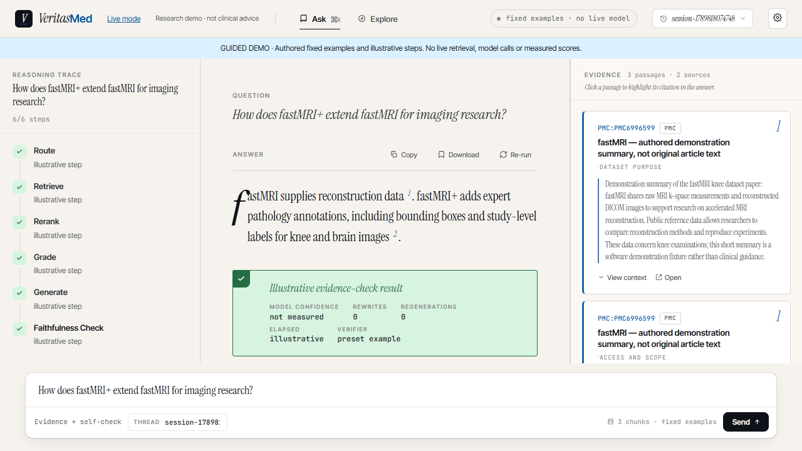
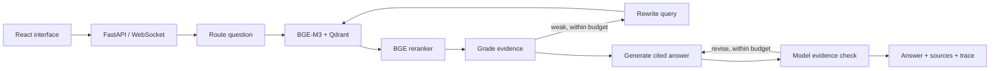

# VeritasMed

**Evidence-grounded medical literature Q&A with an inspectable retrieval and checking workflow.**

VeritasMed connects a React interface to a LangGraph agent: retrieve literature passages, rerank them, assess the evidence, rewrite a weak query, generate a cited answer, and check it against the retrieved context. This repository is a **local research showcase**, not a clinically validated assistant.

**[v0.3.0 research showcase](https://github.com/lijingshan-6/medrag-agent/tree/v0.3.0)** · Python 3.12 · Node.js 22.12+ · Apache-2.0



*Actual application screenshot in Guided demo mode. Answers and animated steps are authored fixtures; they are not a live model run or a benchmark.*

## Try the interface without a key

Only Node.js is needed for this first path:

```sh
git clone https://github.com/lijingshan-6/medrag-agent.git
cd medrag-agent/frontend
npm ci
npm run dev
```

Open **http://127.0.0.1:5173/?demo=1**. Select one of the three example questions, inspect citations and passage context, or use Explore to browse the small fixture. Copy, download and rerun an example from the answer toolbar.

Guided mode runs in the browser. It uses fixed authored answers and text matching over three fixture passages; it makes no backend or model calls. Its disclosure banner stays visible. Arbitrary questions require Live mode.

## Run real retrieval and the agent

Requirements: Python **3.12**, Node.js **22.12+**, and [uv](https://docs.astral.sh/uv/). Initial installation and model downloads require internet access and several GB of disk space. The locked environment uses CPU PyTorch; GPU setup is outside this release's verified path.

From the repository root:

```sh
uv venv --python 3.12
uv pip sync requirements.lock --torch-backend cpu
uv pip install --no-deps -e .
```

Copy `.env.example` to `.env`. For the locally evaluated path, install and start Ollama,
run `ollama pull qwen3.5:9b`, and set these values in `.env`:

```dotenv
LLM_BACKEND=ollama
OLLAMA_HOST=http://127.0.0.1:11434
OLLAMA_MODEL=qwen3.5:9b
LLM_TIMEOUT_SECONDS=240
```

The alternative MiMo path requires a valid `OPENAI_API_KEY` and configured endpoint;
see [the demo guide](docs/demo.md). Never commit `.env`.

Activate the environment:

| Shell | Command |
|---|---|
| Windows PowerShell | `.\.venv\Scripts\Activate.ps1` |
| macOS / Linux | `source .venv/bin/activate` |

Start the demonstration:

```sh
python scripts/run_demo.py
```

The launcher indexes the bundled summaries with BGE-M3, starts the API and frontend, and prints **http://127.0.0.1:5173**. Later starts can use `python scripts/run_demo.py --skip-index`. Ports 8000 and 5173 must be free. If PowerShell blocks activation, invoke `.\.venv\Scripts\python.exe scripts/run_demo.py` directly.

The demo stores vectors and checkpoints under `.demo-runtime/`, uses collection `medrag_demo`, and does not reset the research collection `medrag_text`. **Explore works without an LLM key** after the models and fixture are installed. Live Ask also needs valid model access. The fixture contains three authored summaries about fastMRI and fastMRI+, not the original articles, medical records or MRI files; see its [provenance](data/demo/README.md).

**Verified here:** Windows, Python 3.12, CPU indexing, CUDA reranking, the production Agent graph with local Ollama `qwen3.5:9b`, local review with `medgemma1.5:4b`, API document access, frontend build and browser interactions. Docker, the MiMo cloud path and macOS/Linux execution remain unverified. Read the [v1.1 benchmark report](docs/benchmark-v1.1-report.md) and [validation record](docs/validation-2026-09-18.md) before treating this as a deployment recipe.

## What the project demonstrates

- **Retrieval:** BGE-M3 dense and sparse embeddings, Qdrant hybrid retrieval and a BGE cross-encoder reranker. Explore exposes P2 hybrid and P3 reranked search.
- **Agent control flow:** component search planning, coverage across sources, single-study source constraints, evidence grading and bounded answer repair. Ask always uses the full [agent workflow](docs/agent-workflow.md).
- **Inspectable answers:** source-linked citations, passage context and streamed node activity. A model evidence check is a self-assessment, not a guarantee of factual or clinical correctness.
- **Failure handling:** bounded LLM calls, response deadlines, one terminal stream result, cancellation between nodes and isolation between individual requests.
- **Reproducibility:** dependency lock, frozen corpus hashes, a claim-level 50-question benchmark, saved real answers and an offline command to recompute their metrics.



Each Ask is a standalone question. Session labels in the interface do **not** provide conversational memory or restore previous answers. Internal checkpoints are isolated per request to prevent cross-request result contamination.

## Evidence-grounded benchmark v1.1

The active benchmark contains 50 source-first questions over 44 PubMed sources and 20 domains, with exact claim-level quotes, explicit evidence gaps and five same-topic abstention cases. The 15-question development split and 35-question test split share no source or evidence chunk. All sources in this frozen snapshot are from 2026, and the set is engineering-reviewed rather than clinician-validated.

The v1.1 audit retained 39 contracts and revised 11. `qwen3.5:9b` generated a fresh 80-item candidate pool and re-audited the final set; `medgemma1.5:4b` challenged medical qualifiers; `llama3.1:8b` acted as an independent-family blind challenger. Every model finding was resolved against the frozen passages. Model agreement never created a final label.

The real production Agent graph was run on development only with `qwen3.5:9b`, BGE-M3 hybrid retrieval and CUDA reranking. The test split remains untouched.

| Development result | v0.2 baseline | v0.3 |
|---|---:|---:|
| Required-claim Recall@5, 13 answerable questions | 88.5% | **100.0%** |
| All required claims found@5 | 11/13 | **13/13** |
| nDCG@5 / MRR@5 | 0.8933 / 0.9231 | 0.9546 / 0.9487 |
| Mapped core-claim completeness / citation coverage | 90.0% / 90.0% | 100.0% / 100.0% |
| Answerability score | 80.0% | **93.3%** |
| Missing required qualifiers per question | 1.27 | **0.33** |
| Unsupported or incorrectly scoped additions | 0 | **2** |
| Strict passes | 5/15 (33.3%) | **10/15 (66.7%)** |
| Mean end-to-end latency | 85.1 s | 91.3 s |

The final v0.3 figures come from one complete run at `82e02ab`, followed by Codex source-first
adjudication of all 15 answers. They are development results, not clinician-reviewed or unseen-test
accuracy. The Agent's own checker passed 14/15; it missed the five strict failures and rejected one
content-correct answer. Two extra statements remain unsupported or incorrectly scoped, so the
zero-unsupported-claim target is not met. Core-claim coverage does not imply qualifier completeness.

[v0.3 report](docs/agent-v0.3-report.md) · [All 15 real answers and evidence](docs/agent-v0.3-cases.md) · [Original v1.1 baseline](docs/benchmark-v1.1-report.md) · [Dataset card](data/benchmark/veritasmed_v1_1/dataset_card.md) · [Frozen questions](data/benchmark/veritasmed_v1_1/questions.jsonl)

Recompute the saved scores without a model, GPU, raw corpus or full backend installation:

```sh
python -m pip install "pydantic>=2.7,<3"
python scripts/benchmark/recompute_saved_agent.py
```

This reapplies the published assessments and metric arithmetic; it does not independently judge
new answers. [The run manifest](data/benchmark/veritasmed_v1_1/agent_v03_dev_manifest.json) records
the code, model and file hashes. Dataset maintenance commands remain available:

```sh
python scripts/benchmark/freeze_v1_1.py
python scripts/benchmark/audit_gold.py --questions data/benchmark/veritasmed_v1_1/questions.jsonl --output-dir data/benchmark/veritasmed_v1_1 --profile-only
```

The prior v1 metrics and direct-model component baseline remain preserved in the [v1 report](docs/benchmark-report.md); they are not treated as the production-Agent v1.1 result.

## Historical evaluation, with explicit denominators

These are recalculations of saved artifacts, **not new v0.1.0 benchmark runs**. Original run dates, source commit and full corpus snapshot were not preserved.

| Historical set | Attempted / scored / errors | Composite, scored only | Composite, errors as zero |
|---|---:|---:|---:|
| Strict standard set | 50 / 49 / 1 | 0.6712 | 0.6577 |
| Hard set | 39 / 39 / 0 | 0.8179 | 0.8179 |

| Historical retrieval | Hit@5 | Macro evidence Recall@5 | MRR@20 |
|---|---:|---:|---:|
| P1 dense baseline | 0.5000 | 0.2667 | 0.3547 |
| P2 hybrid | 0.6000 | 0.2933 | 0.4177 |
| P3 hybrid + reranking | 0.7000 | 0.3250 | 0.5134 |

The old retrieval artifact called the first metric Recall@5; it actually measures whether at least one reference is found, so this report calls it **Hit@5**. Strict and hard use different questions and cannot establish a version improvement. The same model family was involved in judging, and there is no matched agent-versus-plain-RAG ablation. These results establish neither clinical accuracy nor agent superiority.

[Full report and input hashes](docs/evaluation_report.md) · [Machine-readable summary](data/eval/release_summary.json)

```sh
python scripts/report_release.py --check
```

## Development checks

With the locked Python environment active:

```sh
python -m pytest -q
ruff check src/
python scripts/report_release.py --check
uv pip check
npm --prefix frontend test
npm --prefix frontend run build
```

Default tests isolate checkpoints, disable local dotenv configuration and do not call external models. Live integration tests require explicit `--run-live` plus separately configured infrastructure; they may incur API charges. [CI](.github/workflows/ci.yml) runs the offline gates and builds a wheel; hosted CI is not claimed as passed before a push.

## Data, privacy and operating limits

- BGE embedding/reranking and Qdrant storage run locally in the supported demo. With MiMo selected, questions and retrieved passages are sent to the configured cloud endpoint. Ollama is an alternative, not the default.
- Browser session labels live in local storage. Backend checkpoints can contain queries, evidence and generated answers. Keep personal health information out of this showcase.
- API and frontend bind to loopback. The HTTP/WebSocket API has no public-user authentication, quotas or multi-tenant isolation and is not ready for direct internet exposure. Optional MCP token handling is separate from the web API.
- Stop/disconnect prevents further graph steps once the current synchronous step yields; it cannot forcibly abort an already running model request. Model requests have separate timeouts.
- Health distinguishes process liveness (`/api/live`) from dependency reachability (`/api/health`). A healthy endpoint does not guarantee a populated collection or a successful generation.
- Original research data, model weights, checkpoints, credentials and generated local environments are not part of the source release. Third-party datasets and papers retain their own terms.

## Repository guide

| Path | Purpose |
|---|---|
| `src/medrag/agent/` | Graph, nodes, prompts and model configuration |
| `src/medrag/api/` | REST and WebSocket interface |
| `src/medrag/index/`, `src/medrag/retrieval/` | Embeddings, indexing and search |
| `frontend/` | React interface and labelled browser fixtures |
| `data/demo/` | Small authored demonstration corpus |
| `data/benchmark/veritasmed_v1_1/` | Frozen benchmark, reviews, original baseline and v0.3 Agent outputs |
| `data/benchmark/veritasmed_v1/` | Preserved historical v1 benchmark and component baselines |
| `data/eval/`, `data/golden/` | Historical evaluation artifacts and question sets |
| `tests/` | Offline behavior and contract regressions |
| `docs/` | Audit, plan, evaluation, validation and release notes |

[Demo walkthrough / optional Docker](docs/demo.md) · [v0.3.0 release notes](docs/releases/v0.3.0.md) · [Changelog](CHANGELOG.md) · [Completed v0.3 plan](docs/superpowers/plans/2026-09-22-veritasmed-agent-v0.3.md) · [Next: v0.4 plan](docs/superpowers/plans/2026-09-22-veritasmed-agent-v0.4.md)

Code and repository-authored demo text are distributed under [Apache-2.0](LICENSE). The [v0.4 plan](docs/superpowers/plans/2026-09-22-veritasmed-agent-v0.4.md) binds each requested component to its study, evidence span and missing qualifiers, exposes evidence gaps in the interface, and measures repeat-run behavior before using the untouched test split. This is planned work; the current implementation remains v0.3.0.
