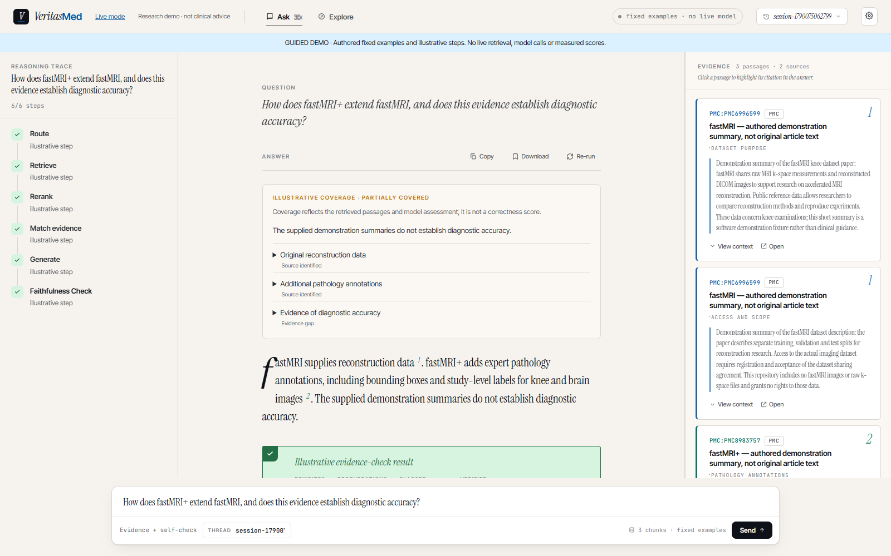
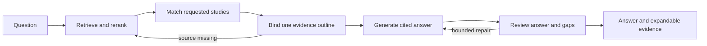

# VeritasMed

**Ask a medical-literature question, inspect the evidence, and see what the sources cannot establish.**

VeritasMed is a React + FastAPI + LangGraph research showcase. It retrieves literature, matches the requested studies, builds an outline bound to exact source passages, generates cited answers, and repairs missing details or unsupported statements. It is not a clinically validated assistant.

**v0.4.0 local research showcase** · Python 3.12 · Node.js 22.12+ · Apache-2.0

The selected model is **Flash for every Agent role**, currently `DeepSeek-V4.1-Flash` through the configured compatible gateway. There is no automatic Pro fallback. The [v0.4 effect report](docs/agent-v0.4-flash-report.md) records actual answers, failures, evaluation status and source-based assessments. Model self-checks and evidence labels are not accuracy scores.



*Actual interface in Guided mode. The answer and animated steps are authored examples, not live inference or benchmark results.*

## Try it without a key

Only Node.js is needed. From this checkout:

```sh
cd frontend
npm ci
npm run dev
```

Open **http://127.0.0.1:5173/?demo=1**. Try the three examples, expand an evidence component and click **View source**. Explore, copy and Markdown download also work. Guided mode uses three fixed passages and authored answers entirely in the browser; arbitrary questions need Live mode.

Repository: [lijingshan-6/medrag-agent](https://github.com/lijingshan-6/medrag-agent). These instructions describe the v0.4 checkout. This local milestone has not yet been pushed. [Version notes](docs/releases/v0.4.0.md)

## Run Live Ask

You need Python **3.12**, Node.js **22.12+**, [uv](https://docs.astral.sh/uv/), and model access. Initial dependency and BGE model downloads need internet access and several GB of disk space. The quick-start uses CPU retrieval; the separate research runs use CUDA.

From the repository root:

```sh
uv venv --python 3.12
uv pip sync requirements.lock --torch-backend cpu
uv pip install --no-deps -e .
```

Copy `.env.example` to `.env` and replace `OPENHUB_API_KEY` with your gateway key. The example already selects the Flash profile:

```dotenv
LLM_BACKEND=openhub
OPENHUB_BASE_URL=https://www.cun.ai/v1
OPENHUB_API_KEY=your-gateway-key
OPENHUB_MODEL=DeepSeek-V4.1-Flash
OPENHUB_REASONING_EFFORT=high
OPENHUB_MAX_TOKENS=32768
LLM_TIMEOUT_SECONDS=240
```

Keep the real key only in the ignored `.env`. Cloud inference sends questions and retrieved passages to that endpoint. `openhub` is the existing backend configuration name; the base URL and exact model ID select the compatible gateway. The model ID is provided by that gateway; this project does not independently authenticate its underlying weights or guarantee equivalence across providers.

For local generation, install/start Ollama, run `ollama pull qwen3.5:9b`, and replace the backend selection in `.env`:

```dotenv
LLM_BACKEND=ollama
OLLAMA_HOST=http://127.0.0.1:11434
OLLAMA_MODEL=qwen3.5:9b
LLM_TIMEOUT_SECONDS=240
```

Activate the environment and launch:

| Shell | Activate |
|---|---|
| Windows PowerShell | `.\.venv\Scripts\Activate.ps1` |
| macOS / Linux | `source .venv/bin/activate` |

```sh
python scripts/run_demo.py
```

Open **http://127.0.0.1:5173**. The launcher indexes the bundled passages and starts both services. Ports **8000 and 5173** must be free. Later starts can use `python scripts/run_demo.py --skip-index`. If PowerShell blocks activation, invoke `.\.venv\Scripts\python.exe scripts/run_demo.py` directly. Stop the launcher with Ctrl+C.

The demo uses a separate `.demo-runtime/` store and `medrag_demo` collection. Its three passages are **authored fastMRI/fastMRI+ summaries**, not original articles or the research corpus. Explore needs no LLM key; Live Ask needs working model access. [Demo provenance](data/demo/README.md) · [Walkthrough, configuration and troubleshooting](docs/demo.md)

The locked installation path was exercised on Windows with cached model downloads. A current Flash browser answer, source expansion and Markdown export completed successfully; see the [real walkthrough and its label limitation](docs/demo.md#current-flash-browser-run--2026-09-23). Docker and macOS/Linux execution have not been exercised on the release host.

## What v0.4 demonstrates

- **Finding the right studies:** BGE-M3 dense/sparse retrieval, Qdrant and cross-encoder reranking. Source identity is checked before the final five passages are selected. Identifier matching prioritizes candidates without discarding natural wording such as descriptive suffixes.
- **Answers tied to evidence:** one shared outline covers the actual question across all selected studies. Each answer part retains its source, quotation and evidence gap.
- **Bounded factual wording and repair:** critical numerical, population and method components use selected source sentences; separately requested design explanations remain generative. Generation and review see the complete answer and all gaps, and rejected explanations stay flagged after quotation recovery.
- **Inspectable results:** streaming workflow steps, complete/partial/insufficient coverage, expandable quotations and source navigation. Some factual answers intentionally read as evidence excerpts and can remain verbose.
- **Reviewable research:** a frozen, source-disjoint 50-question dataset, saved real Agent outputs, explicit source-based judgments and offline score recalculation. Failed attempts remain available.



[Current workflow and limits](docs/agent-workflow.md)

## Actual answer quality

Use the [Flash v0.4 report](docs/agent-v0.4-flash-report.md) as the current result entry point. It distinguishes development, independent repetitions and the once-held-out test split, with model settings, denominators, timings and every retained failure. A green internal check does not establish that an answer is correct.

| Frozen Flash implementation | Strict answer passes |
|---|---:|
| Full development set | 15/15 |
| Independent repeat of declared difficult cases | 10/10 |
| First held-out test | **31/35 (88.6%)** |

All 60 requests completed and source-first review found no unsupported material additions. Four held-out answers still omitted a required result, endpoint qualifier or clinical evidence boundary. All 32 answerable held-out questions retrieved their required evidence, so finding the source did not ensure answer completeness. The test split was used once after code freeze and is now exposed.

The dataset has **15 development and 35 test questions from 44 sources**, with no source overlap between splits. Most evidence is abstract-level, all source records are from the frozen 2026 snapshot, and labels and answer judgments have not received independent clinician review. These are engineering measurements, not clinical accuracy or proof that the Agent outperforms plain RAG. [Dataset card](data/benchmark/veritasmed_v1_1/dataset_card.md)

Historical Qwen repairs and the earlier Pro/Flash comparison describe different implementations/runs. Their scores are preserved in the [documentation index](docs/README.md), not reused as current Flash results.

Saved cases can be read without models, API access or the full corpus. Recompute an explicitly reviewed Flash run from the repository root:

```sh
python -m pip install "pydantic>=2.7,<3"
python scripts/benchmark/report_flash_release.py --directory data/benchmark/veritasmed_v1_1/v04_flash_development_final --case-name agent-v0.4-flash-development-cases
```

This reapplies saved judgments and arithmetic; it does not independently judge the answers again. New inference requires the separately prepared research corpus/index and new source reviews; see the [research profile](docs/demo.md#flash-research-profile).

## Operating limits

- Responses can still omit qualifiers, misinterpret a source or label coverage incorrectly. Read the cited passages. This showcase is not for individual diagnosis or treatment decisions.
- Repetition exposed a concrete label limitation: an answer can correctly explain an unmeasured longitudinal outcome while the interface still calls its evidence coverage complete. Content judgments and coverage-label mismatches are reported separately.
- The browser request has a 300-second overall deadline. Stop prevents later graph steps; an in-flight synchronous model call can finish in the background.
- Services bind to loopback. The web API has no public-user authentication or multi-tenant isolation; keep this as a local showcase. Checkpoints may retain questions and answers, so do not use personal health information.
- Raw research papers, images, model weights, local indexes and credentials are not included in the repository. The tiny demo and saved evaluation are the usable source-release paths. Third-party materials retain their own terms.

## Repository and development

| Path | Purpose |
|---|---|
| `src/medrag/agent/` | Graph, source binding, prompts and model backends |
| `src/medrag/api/` | REST and WebSocket API |
| `src/medrag/index/`, `src/medrag/retrieval/` | Indexing and search |
| `frontend/` | React interface and labelled Guided fixtures |
| `data/demo/` | Bundled authored summaries |
| `data/benchmark/veritasmed_v1_1/` | Gold dataset, original outputs, reviews and runtime snapshots |
| `docs/` | Setup, results, historical experiments and release notes |

For code changes, the existing offline checks are `python -m pytest -q`, `ruff check src/`, `npm --prefix frontend test` and `npm --prefix frontend run build`. They make no paid model calls. Live integration requires explicit `--run-live` and configured infrastructure.

[Documentation index](docs/README.md) · [Demo guide](docs/demo.md) · [v0.4 results](docs/agent-v0.4-flash-report.md) · [Version notes](docs/releases/v0.4.0.md) · [Changelog](CHANGELOG.md) · [License](LICENSE)
