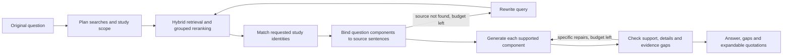

# Current Agent workflow (v0.4 development)

The production Ask graph answers one standalone question using retrieved literature.
The browser API and `scripts/benchmark/run_agent.py` call the same graph.
Guided mode uses labelled browser fixtures and does not execute this graph.

## Questions, sources and the answer outline

The router proposes up to three component searches and a study scope. Retrieval includes
the original question and latest rewrite, with at most four distinct queries and 12 candidates
per query. Grouped reranking retains the best evidence for each query, allowing two components
to share the same study or passage. It retains up to five chunks.

Within the grade node, single-study and multi-study questions first select matching study
identities from the retrieved candidates. Selection uses the original question, titles and
passages; it does not simply adopt the first-ranked source. Subsequent generation and checking
read only the selected studies. This selection is a model decision and can itself be wrong.

The program assigns local IDs to source sentences. The model selects these IDs to build an
outline covering the original question. The program resolves them to the exact source text,
chunk ID and citation. Population details, comparison values and relevant uncertainty travel
with the component they qualify. Model-supplied details must occur in their bound quotation.
Unanswered outcomes remain explicit components with an evidence gap.

This prevents transcription errors and mechanical source mismatches; it does not prove that
a quoted sentence semantically supports a conclusion. Neither the Agent nor its prompts read
benchmark answers, question IDs or adjudications.

## Generation and targeted repair

Every generated claim carries a component ID and references only citations bound to that
component. A claim with an unknown component or wrong source is rejected. Supported results
and gaps are assembled into the final answer. Boundary questions do not substitute adjacent
diagnostic results for unsupported clinical conclusions.

Evidence-boundary questions use a shorter, endpoint-focused outline prompt: it lists only the
outcomes actually asked about. A question with one supported part and one missing part retains
the supported part, instead of becoming a blanket refusal.

The checker evaluates the original question, outline, answer and source text together. It can
identify incomplete components and downgrade an outline component whose evidence does not
actually establish its requested outcome. A separate numeric-presence check catches omissions
from the outline's required numerical details; it does not assess units, causality or semantic
equivalence. Those still require source review.

Repairs replace only the identified components and preserve the others. There are at most two
answer repairs and two retrieval rewrites. Invalid structured output receives one local retry.
Omitted required numbers are restored by quoting their exact bound source sentence before the
check, without an extra generation call. Explicit cohort-enrolment sentences are also retained
when the model omits its population field. This is visibly attributed text, not an invented paraphrase. A source
inference rejected by the last check is removed even when the repair budget is exhausted.
The repair can also clarify a missing component's gap without changing its evidence status.
If issues remain at the repair limit, the response retains its unresolved check status. A
completed request is not necessarily a correct answer.

## Interface and runtime

The API adds optional `evidence_status`, `evidence_gap` and `answer_components` fields to the
existing answer. The interface presents coverage as complete, partial or insufficient, with
expandable quotations and links to their source passages. Coverage and the model's self-check
describe the current evidence assessment; neither is a clinical correctness score. The model's
self-reported confidence remains in the API for compatibility but is not shown as a percentage.

The current local model is Ollama `qwen3.5:9b`, with an 8,192-token context and a 4,096-token output
limit for both tiers. Routing, source-identity selection and generation use direct output at
temperature 0.2; ordinary grading and checking use direct output at temperature 0.0.
Evidence-boundary questions enable reasoning for their outline at temperature 1.0, following the
general thinking temperature in the [Qwen model card](https://huggingface.co/Qwen/Qwen3.5-9B#best-practices).
The output limit includes reasoning tokens. These settings do not guarantee reproducibility. The local development runs use CPU
BGE-M3 embeddings and CUDA BGE reranking; the README installation path uses CPU PyTorch.

Each browser Ask has an isolated checkpoint. Session labels do not restore conversation memory.
The browser API has a 300-second overall response deadline. Cancellation stops future graph
steps; an already running synchronous model request may finish in the background.

## Results and limitations

The implementation is being evaluated; see the [v0.4 worklog](agent-v0.4-worklog.md).
The [v0.3 report](agent-v0.3-report.md) remains the published baseline.
The 35-question test split has not been used during v0.4 development.

- [v0.4 implementation plan](superpowers/plans/2026-09-22-veritasmed-agent-v0.4.md)
- [Demonstration guide](demo.md)
- [Frozen benchmark](benchmark-v1.1-report.md)
