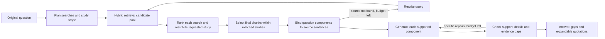

# Current Agent workflow (v0.4 development)

The production Ask graph answers one standalone question using retrieved literature.
The browser API and `scripts/benchmark/run_agent.py` call the same graph.
Guided mode uses labelled browser fixtures and does not execute this graph.

## Questions, sources and the answer outline

The router proposes up to three complete study-specific questions and a study scope, using only
the user's question. These are both search queries and later answering tasks; they retain methods
and results when both were requested. Retrieval includes
the original question and latest rewrite, with at most four distinct queries and 12 candidates
per query. Each query's candidates are ranked before source matching, which sees the four highest
ranked distinct studies per component query (their union for a single-study question). Matching
happens before the final five-chunk truncation. Grouped selection retains the best evidence within those matching studies,
allowing two components to share the same study or passage. It retains up to five chunks.

Single-study and multi-study questions select matching study identities before final chunk selection.
Selection uses the original question, titles and passage excerpts; it does not simply adopt
the first-ranked source. Subsequent generation and checking
read only the selected studies. This selection is a model decision and can itself be wrong.

The program assigns local IDs to source sentences. The model selects these IDs to build an
outline covering the original question. The program resolves them to the exact source text,
chunk ID and citation. Population details, comparison values and relevant uncertainty travel
with the component they qualify. Model-supplied details must occur in their bound quotation.
Unanswered outcomes remain explicit components with an evidence gap.
For multi-study questions matching keeps the pre-retrieval subquestion unchanged; source content
cannot add new requirements. Each study gets a separate outline and support review, retaining
global sentence IDs when combining the results. This reduces lost or misattributed findings.
Selected contrasts retain their null-result clause, and method components retain the actual
method steps. Plainly labelled development, calibration, test and validation counts keep their
source role; losing that role rejects the claim. This narrow guard cannot resolve every ambiguity.

This prevents transcription errors and mechanical source mismatches; it does not prove that
a quoted sentence semantically supports a conclusion. Neither the Agent nor its prompts read
benchmark answers, question IDs or adjudications.

## Generation and targeted repair

Every generated claim carries a component ID and references only citations bound to that
component. A claim with an unknown component or wrong source is rejected. Supported results
and gaps are assembled into the final answer. Boundary questions do not substitute adjacent
diagnostic results for unsupported clinical conclusions.

Evidence-boundary questions assess whether the requested outcomes were measured and whether the
requested comparison is actually supported. Measured survival in a single arm cannot demonstrate
superiority over an absent control. The original question retains its outcomes and comparator together.
Missing components default to a statement of the unestablished outcome/comparison. They do not
generate a free-form explanation of why data are absent. The source text is deduplicated in
prompts so repeated component quotations do not crowd out the original question or instructions.

The checker evaluates the original question, outline, answer and source text together. It can
identify incomplete components and downgrade an outline component whose evidence does not
actually establish its requested outcome. A separate numeric-presence check catches omissions
from the outline's required numerical details; it does not assess units, causality or semantic
equivalence. Those still require source review.

Repairs replace only the identified components and preserve the others. There are at most two
answer repairs and two retrieval rewrites. Invalid structured output receives one local retry.
Numerical and method components preserve their selected full source sentences before the check,
even when a generated paraphrase contains every digit. This keeps the actor and comparison with
the estimate. Explicit cohort-enrolment sentences are also retained
when the model omits its population field. This is visibly attributed text, not an invented paraphrase. A source
inference rejected by the last check is removed even when the repair budget is exhausted.
Missing-component gaps retain their requested outcome; generator prose cannot add a new outcome.
Design-based explanations stay separate from numerical quotations and still receive semantic review.
If issues remain at the repair limit, the response retains its unresolved check status. A
completed request is not necessarily a correct answer.

## Interface and runtime

The API adds optional `evidence_status`, `evidence_gap` and `answer_components` fields to the
existing answer. The interface presents coverage as complete, partial or insufficient, with
expandable quotations and links to their source passages. Coverage and the model's self-check
describe the current evidence assessment; neither is a clinical correctness score. The model's
self-reported confidence remains in the API for compatibility but is not shown as a percentage.

The current local model is Ollama `qwen3.5:9b`, with an 8,192-token context and a 4,096-token output
limit for both tiers. Routing, source-identity selection and generation use direct output at
temperature 0.2; ordinary grading and checking use direct output at temperature 0.0.
The current repair uses direct output for boundary outlines too, and Ollama JSON mode for all
structured steps; checking additionally uses a schema requiring a decision for each component.
This prevents a reasoning trace from consuming the final-output budget, but
does not establish the truth of a JSON field. These settings do not guarantee reproducibility. The local development runs use CPU
BGE-M3 embeddings and CUDA BGE reranking; the README installation path uses CPU PyTorch.

Each browser Ask has an isolated checkpoint. Session labels do not restore conversation memory.
The browser API has a 300-second overall response deadline. Cancellation stops future graph
steps; an already running synchronous model request may finish in the background.

## Results and limitations

The first candidate achieved 9/15 strict development passes; see the [v0.4 report](agent-v0.4-report.md).
The current fixes are being evaluated separately in the [repair worklog](agent-v0.4-repair-worklog.md).
The [v0.3 report](agent-v0.3-report.md) remains the published baseline.
The 35-question test split has not been used during v0.4 development.

- [v0.4 implementation plan](superpowers/plans/2026-09-22-veritasmed-agent-v0.4.md)
- [Demonstration guide](demo.md)
- [Frozen benchmark](benchmark-v1.1-report.md)
