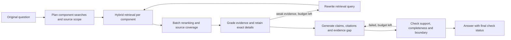

# Current Agent workflow (v0.3)

The production Ask graph answers one standalone question using retrieved literature.
The same graph is called by the browser API and `scripts/benchmark/run_agent.py`.
Guided mode uses authored browser fixtures and does not execute this graph.

## Question and source planning

The router supplies up to three component queries and a compact list of requested answer
components. Retrieval combines these with the original question and latest rewrite, with
at most four distinct queries and 12 candidates per query. Generation and checking always
receive the original question, even after a retrieval rewrite.

`source_scope` distinguishes a single study, multiple sources and a general question.
Questions about one study's methods and outcomes remain single-study questions. Multi-source
reranking reserves evidence per component before filling remaining positions by score;
single-study context keeps only the leading source. At most five chunks reach the answerer.
Selecting the wrong leading source is still a possible failure mode, and PMID and PMC keys
are treated as separate sources; the system does not resolve two identifiers for one paper.

## Answer construction

The grader supplies exact details from the retrieved passages. These are combined with the
question's components and expanded to source sentences to preserve numbers and uncertainty.
Explicit toxicity and adverse-event requests receive their own checklist entries. Source
text cleanup removes HTML tags while retaining mathematical inequalities.

The answer model returns cited claims, confidence, `evidence_status` and `evidence_gap`.
Only citation keys present in the retrieved context survive validation. The evidence status
is `complete`, `partial` or `insufficient`. An insufficient-evidence answer contains the
declared missing comparison or outcome; for evidence-boundary questions, adjacent findings
are discarded when the requested conclusion lacks support.

The final checker evaluates support, completeness and the evidence boundary separately.
It can request up to two regenerations. Retrieval allows up to two rewrites. A malformed JSON
response receives one local retry before normal graph handling. Reaching the regeneration
limit returns the final answer with `faithful=false` and its unresolved issues; termination
does not imply that the answer passed. The model's confidence and self-check are not external
accuracy measurements.

## Runtime and interface

The evaluated local configuration uses Ollama `qwen3.5:9b`, reasoning disabled, 4,096 tokens
for routing/generation and 6,144 for grading/checking. The two model tiers use temperatures
0.2 and 0.6. Repeated outputs can therefore differ. BGE-M3 embeddings run on CPU and the BGE
reranker runs on CUDA on the evaluated host. The setup path in the README installs CPU
PyTorch for portability; CUDA requires a compatible local PyTorch installation.

Each browser Ask has an isolated checkpoint ID. UI session labels do not restore a conversation.
The WebSocket has a 300-second response deadline. Cancellation stops future graph steps;
an in-flight synchronous model call can finish in the background.

The browser receives the answer, citations, retrieved passages, final `faithful` status,
unresolved issues, rewrite count and regeneration count. Search plans and the three detailed
check dimensions are currently available in saved benchmark traces, not as separate UI cards.

## Reading the evidence

- [v1.1 benchmark and original baseline](benchmark-v1.1-report.md)
- [v0.3 development comparison](agent-v0.3-report.md)
- [Demonstration guide](demo.md)
- Implementation: `src/medrag/agent/{graph,nodes,prompts,state}.py`,
  `src/medrag/retrieval/reranker.py`, `src/medrag/api/routes/ask.py`

The development comparison uses all 15 questions in one final run. It evaluates saved answers
against frozen evidence; it is not clinician validation or evidence of performance on unseen
questions. The 35-question test split has not been run for this milestone.
