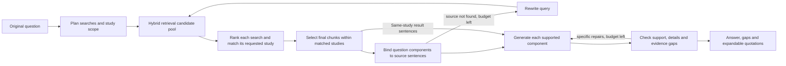

# Current Agent workflow (v0.4.0 research showcase)

The production Ask graph answers one standalone question using retrieved literature.
The browser API, the Ollama runner `scripts/benchmark/run_agent.py`, and the OpenHub runner
`scripts/benchmark/compare_agent_models.py` call the same graph.
Guided mode uses labelled browser fixtures and does not execute this graph.

As of 2026-09-23, the research baseline is Flash, currently `DeepSeek-V4.1-Flash`
through the user's compatible gateway; see the [model decision](decisions/2026-09-23-flash-research-baseline.md).
The workflow below describes the current implementation, including its remaining limitations.

## Questions, sources and the answer outline

The router proposes up to three complete study-specific questions and a study scope, using only
the user's question. These are retrieval aids; the original question controls answering requirements. They retain methods
and results when both were requested. Retrieval includes
the original question and latest rewrite, with at most four distinct queries and 12 candidates
per query. Each query's candidates are ranked before source matching, which sees the four highest
ranked distinct studies per component query (their union for a single-study question).
Explicit alphanumeric target/model matches prioritize candidates before this four-study limit,
but are not hard exclusions. The matcher sees lexical match/mismatch hints and must distinguish
true identity differences from descriptive suffixes or formatting. Reference-list chunks cannot
identify a primary study. Candidate pools can share a study across component searches. These steps narrow identity errors but do
not prove identity or support. Matching
happens before the final five-chunk truncation. Grouped selection retains the best evidence within those matching studies,
allowing two components to share the same study or passage. It retains up to five chunks.

Single-study and multi-study questions select matching study identities before final chunk selection.
Selection uses the original question, titles and passage excerpts; it does not simply adopt
the first-ranked source. Subsequent generation and checking
read only the selected studies. This selection is a model decision and can itself be wrong.

The program assigns local IDs to source sentences. The model selects these IDs to build an
outline covering the original question. The program resolves them to the exact source text,
chunk ID and citation. Population details, comparison values and relevant uncertainty travel
with the component they qualify. Model-supplied details must occur in their bound quotation.
Unanswered outcomes remain explicit components with an evidence gap.
For multi-study questions matching keeps the pre-retrieval subquestion unchanged; source content
cannot add new requirements. All selected studies enter one shared outline and whole-answer
review. Each component keeps its own source bindings and global sentence IDs. This lets the
reviewer see when one study's gap contradicts a result already supplied by another component.
Selected contrasts retain their null-result clause, and method components retain the actual
method steps. Plainly labelled development, calibration, test and validation counts keep their
source role; losing that role rejects the claim. This narrow guard cannot resolve every ambiguity.
Unreported shared or independent validation datasets are also rejected when expressed through
cohort aliases. A multicenter result alone does not specify a training/validation partition.

This rejects unbound quotations and mechanical source mismatches; it does not prove that
a quoted sentence semantically supports a conclusion. Neither the Agent nor its prompts read
benchmark answers, question IDs or adjudications.

## Generation and targeted repair

Every generated claim carries a component ID and references only citations bound to that
component. A claim with an unknown component or wrong source is rejected. Generation
can recover sentences missed by the outline: generation sees global sentence IDs for the selected
sources and declares which support each claim. Those IDs are bound only within the component's
existing study; they cannot upgrade a missing outcome or add another study. The actual quote is
then available to the interface and source review, not just a citation to a nearby definition.
Supported results
and gaps are assembled into the final answer. Boundary questions do not substitute adjacent
diagnostic results for unsupported clinical conclusions.

Evidence-boundary questions assess whether the requested outcomes were measured and whether the
requested comparison is actually supported. Measured survival in a single arm cannot demonstrate
superiority over an absent control. The original question retains its outcomes and comparator together.
Missing components default to a statement of the unestablished outcome/comparison. They do not
echo instructions such as "identify what remains untested": open questions use a specific missing
outcome/setting phrase, checked against the source. Fixed yes/no questions retain their requested
outcomes and comparator. Gaps do not
generate a free-form explanation of why data are absent. The source text is deduplicated in
prompts so repeated component quotations do not crowd out the original question or instructions.

The checker evaluates the original question, outline, answer and source text together. It can
identify incomplete components and downgrade an outline component whose evidence does not
actually establish its requested outcome. A separate numeric-presence check catches omissions
from the outline's required numerical details; it does not assess units, causality or semantic
equivalence. Those still require source review.

Repairs replace only the identified components and preserve the others. There are at most two
answer repairs and two retrieval rewrites. Invalid structured output receives one local retry.
Critical numerical, population and method components use selected, attributed source sentences
in the main answer. This is extractive presentation: a generated paraphrase cannot add an
unreported mechanism or validation partition to these facts. A separately requested design
explanation remains generative and undergoes source review. Full quotations also remain in
expandable evidence. This trades some fluency and brevity for faithful factual wording; it does
not prove that the selected sentences answer the question. Omitted bound numbers and substantial
method omissions can still receive quotation recovery. Numbers already stated with the same
study's citation need not be quoted twice.
Selected non-numeric contrasts also receive a lexical omission check. This can repeat a valid
paraphrase unnecessarily; it is a preservation fallback, not a semantic equivalence score.
Actors, comparisons and causal limits still require semantic review. Explicit cohort-enrolment sentences are also retained
when the model omits its population field. This is visibly attributed text, not an invented paraphrase. A source
inference rejected by the last check is removed even when the repair budget is exhausted.
Missing-component gaps retain their requested outcome; generator prose cannot add a new outcome.
Design-based explanations stay separate from numerical quotations and still receive semantic review.
An explanation logically entailed by a reported design is permitted without a verbatim author
statement. A narrow guard rejects invented simultaneous-measurement wording when the bound
source does not report it. For a supported causal-limit component bound to one explicitly
cross-sectional study, that failure has a narrow deterministic repair: quote the reported design
and state that its association alone does not establish causal direction or an intervention benefit.
This is recorded separately as `design_scope`. Other designs and safe explanations retain model
review; the rule is not a general causal-reasoning validator. Generation and
review are also instructed to retain validation settings and data types, but can still miss them.
If issues remain at the repair limit, the response retains its unresolved check status. A
completed request is not necessarily a correct answer.
Restoring a source quotation does not clear the rejection of an unsupported explanation;
the original binding issue continues into checking and targeted repair.

## Interface and runtime

The API adds optional `evidence_status`, `evidence_gap` and `answer_components` fields to the
existing answer. The interface presents coverage as complete, partial or insufficient, with
expandable quotations and links to their source passages. Coverage and the model's self-check
describe the current evidence assessment; neither is a clinical correctness score. The model's
self-reported confidence remains in the API for compatibility but is not shown as a percentage.
In the independent Flash repetition, a correctly worded longitudinal evidence limit still received
a `complete` label. The classifier can mistake a fully answered question about a gap for complete
outcome evidence. This remains a presentation limitation and is reported separately from answer content.

The selected research profile explicitly sets `LLM_BACKEND=openhub` and
`OPENHUB_MODEL=DeepSeek-V4.1-Flash` and `OPENHUB_BASE_URL=https://www.cun.ai/v1`.
The existing `openhub` backend name supports that configured compatible endpoint. Both LLM tiers
use the same model ID, with thinking enabled,
reasoning effort `high`, a 32,768-token output ceiling per call, streamed transport and a
240-second client timeout. Structured calls request JSON-object output; the checker schema
remains in the prompt. The output ceiling is not actual usage. The research runner shares
CUDA embedding/reranking models across at most three question jobs and defaults to Flash only.
See [configuration and commands](demo.md#flash-research-profile).

The local alternative and historical repair profile use Ollama `qwen3.5:9b`, with an 8,192-token context and a 4,096-token output
limit for both tiers. Routing, source-identity selection and generation use direct output at
temperature 0.0; ordinary grading and checking also use direct output at temperature 0.0.
The current repair uses direct output for boundary outlines too, and Ollama JSON mode for all
structured steps; checking additionally uses a schema requiring a decision for each component.
This prevents a reasoning trace from consuming the final-output budget, but
does not establish the truth of a JSON field. These settings do not guarantee reproducibility. The saved Qwen development runs used CPU
BGE-M3 embeddings and CUDA BGE reranking; the README installation path uses CPU PyTorch.

Without an explicit backend setting, the code still defaults to MiMo; that fallback is distinct
from the selected Flash research profile and the documented Ollama local demo.

Each browser Ask has an isolated checkpoint. Session labels do not restore conversation memory.
The browser API has a 300-second overall response deadline. Cancellation stops future graph
steps; an already running synchronous model request may finish in the background.

## Results and limitations

The first Qwen candidate achieved 9/15 strict development passes; see the [v0.4 report](agent-v0.4-report.md).
The independent Qwen repaired run passes 15/15; see the [repair report](agent-v0.4-repaired-report.md) and [worklog](agent-v0.4-repair-worklog.md).
The later [Pro/Flash comparison](agent-model-comparison-report.md) records distinct results and
shared defects in source filtering, requirements, gap rendering and self-checks. Changing the
selected baseline to Flash does not resolve those defects or transfer Qwen's score to Flash.
Current Flash changes and measured outcomes are tracked in the [convergence report](agent-v0.4-flash-report.md).
The [v0.3 report](agent-v0.3-report.md) remains the published baseline.
After final Flash development (15/15) and independent repetition (10/10), the implementation
was frozen before its first 35-question held-out run: 31/35 strict passes, with no execution
errors or observed unsupported material additions. Four answers omit required results or
boundaries despite finding the necessary evidence. The self-check passes all 35, including
those failures. No inference changes followed the test; these questions are now exposed
and cannot serve as unseen evidence for later fixes.

- [Documentation index and maintained scope](README.md)
- [Initial v0.4 implementation plan (historical)](superpowers/plans/2026-09-22-veritasmed-agent-v0.4.md)
- [Demonstration guide](demo.md)
- [Frozen benchmark](benchmark-v1.1-report.md)
