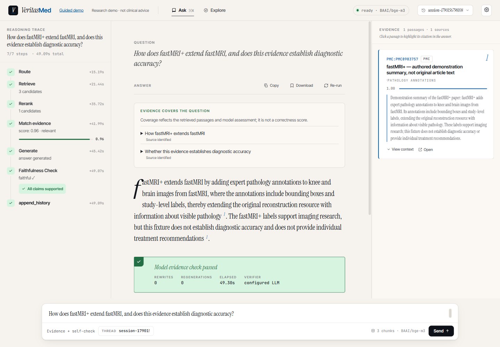

# VeritasMed v0.4.0 — Flash evidence-bound answers

Published to GitHub on **2026-09-23** as a **research showcase milestone**, on `main`
and source tag [`v0.4.0`](https://github.com/lijingshan-6/medrag-agent/tree/v0.4.0).
The tag is the fixed source version. No separate GitHub Release page is created.

[Download source ZIP](https://github.com/lijingshan-6/medrag-agent/archive/refs/tags/v0.4.0.zip) ·
[Start from the README](../../README.md) · [Demonstration guide](../demo.md)

This version ties answer components to exact source passages, preserves critical factual
context and exposes what the evidence cannot establish. All Agent roles use Flash through
the configured compatible gateway. The current result is useful for a portfolio demonstration,
with retained failures and explicit limits rather than a claim of clinical readiness.

## What changed since v0.3

The main change is answer-level evidence control: requested studies are matched before the
final passage selection, each answer component carries its exact supporting text, and review
checks the complete answer together with the gaps. The interface exposes those components
so a visitor can inspect both a finding and the limits of its evidence.

Flash replaces the earlier Qwen research profile as the selected baseline. The code, model
and provider have all changed across milestones, so their scores are separate observations,
not a controlled measure of the effect of one algorithm. This release also completes the
first held-out evaluation and packages its failures alongside successful examples.

## Delivered behavior

- Match requested studies before final passage selection without rejecting descriptive suffixes.
- Build one outline and review the complete answer and gaps across the original question.
- Preserve critical numerical, population and method findings as attributed source sentences;
  keep requested design explanations generative, with narrow binding and repair safeguards.
- Show source quotations, coverage labels, source navigation and Markdown export. Restore the
  source document page's styling and scrolling, including mobile reading.
- Keep a labelled browser-only Guided demo and a separate three-passage Live fixture.
- Preserve real answers, source-first assessments, failed development attempts and offline score
  recalculation commands. Keep secrets and the large research index outside the repository.

## Answer quality under the frozen contract

| Run | Strict passes | Required evidence | Execution errors |
|---|---:|---:|---:|
| Development | 15/15 | 13/13 answerable | 0 |
| Independent repeat | 10/10 | 8/8 answerable | 0 |
| First held-out test | **31/35 (88.6%)** | 32/32 answerable | 0 |

Source-first review observed no unsupported material additions in these three runs.
The four held-out failures remain in the release:

| Case | What the answer still misses |
|---|---|
| [023](../agent-v0.4-flash-test-cases.md#vmg-023) | The clinical-adoption and patient-outcome evidence boundary. |
| [037](../agent-v0.4-flash-test-cases.md#vmg-037) | Independent MVI and AFP-L3 prognostic estimates and their intervals. |
| [041](../agent-v0.4-flash-test-cases.md#vmg-041) | The composite endpoint definition and causal-design limit. |
| [049](../agent-v0.4-flash-test-cases.md#vmg-049) | The requested rehabilitation-versus-usual-care and patient-outcome gap. |

The internal checker passed all 35 test answers, including those failures. It cannot
substitute for external assessment.

The original seven repeats pass 7/7; the predeclared extra three pass 3/3. Code was frozen
before the one held-out run, and no answer was selected across reruns. The 35 questions are now
exposed; later fixes require fresh independent evidence before claiming unseen performance.

[Full report and all cases](../agent-v0.4-flash-report.md) ·
[Freeze manifest and source snapshot](../../data/benchmark/veritasmed_v1_1/v04_flash_release/freeze_manifest.json)

## Demonstration and practical limits

The actual Flash browser example completed in 49.30 seconds and correctly explained the
fastMRI+ annotations while withholding diagnostic accuracy. Expandable evidence, source
highlighting, Live Explore, the source document route and Markdown download were exercised.
The [demo guide](../demo.md) includes real screenshots and distinguishes this authored-summary
fixture from original research papers and from the Guided examples.

*Actual model output over the bundled authored-summary fixture; not a research-corpus score.*

Answers can be verbose. Coverage labels can disagree with correctly worded boundaries;
some held-out disagreements also expose question/gold scope ambiguity. The current browser
screenshot preserves a complete label despite its stated diagnostic-accuracy limit. These
limitations are documented, not hidden by changing the gold dataset or screenshot content.

Evaluation uses AI source-first judgments, mostly abstract-level evidence and gateway-provided
model identifiers. There is no independent clinician review, plain-RAG ablation or authenticated
cross-provider model equivalence. New-gateway token usage is mostly unavailable; partial
reported usage is not a cost total. This is not for individual diagnosis or treatment.

The Windows locked demo installation was exercised; current relevant Python tests pass (97),
and the updated frontend builds and renders on desktop/mobile. The earlier full offline suite
and frontend tests also passed during this work. Docker and macOS/Linux were not executed
on the release host. Publication runs the existing GitHub workflow; its status is available
on the [Actions page](https://github.com/lijingshan-6/medrag-agent/actions/workflows/ci.yml).

## Publication record

The implementation and saved evaluation were committed as `b18f08f`; subsequent publication
edits organize documentation and version access. The 65-file pre-test runtime snapshot,
frozen questions, scoring rules and all original answers remain unchanged.

## Continue research

Prioritize outcome/endpoint completeness, precise gaps, coverage-label meaning and concise
presentation. Preserve the four exposed test failures as regression cases. Clarify the three
documented gold-scope ambiguities in a new dataset version, with independent review where
possible; do not reclassify this release's failed answers to improve its reported score.
